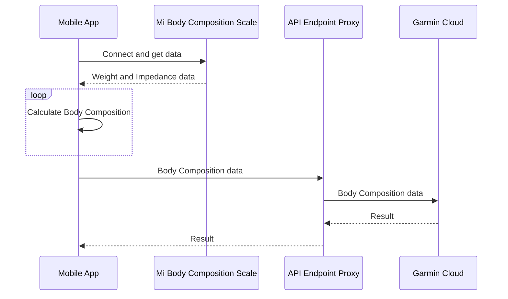
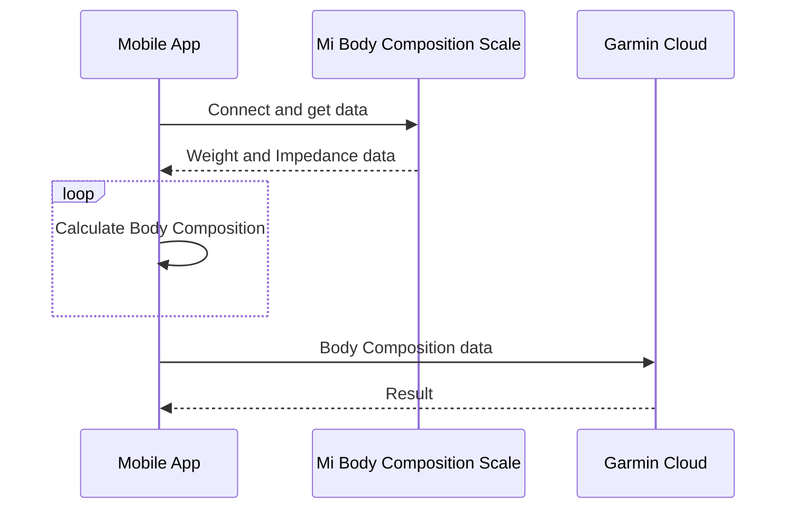

# mi-scale-exporter

Mobile App to export data from Mi Body Composition Scale (works with Mi Scale too) and upload it to Garmin Connect Cloud. It also allows you to upload manually entered body composition data to the Garmin cloud.

Tested on Oneplus 5T (Android 10) and Mi Body Composition Scale (XMTZC02HM)

## Download

- Google play: https://play.google.com/store/apps/details?id=com.lukaszswiderski.MiScaleExporter
- APK/ABB installers: https://github.com/lswiderski/mi-scale-exporter/releases

## Instruction

- Stand on your scale. Measure yourself. Complete the user form data, Scale Bluetooth address and get data from the scale. Mi Body Composition Scale is active up to 15 min after the measurement. (Bluetooth address can be found in Zepp Life > Profile > My devices > Mi Body Composition Scale > Bluetooth address (hold to copy)).

- If your scale supports "Weigh small object" - turn it off

- Then you can review your data and upload it to Garmin Cloud. If you do not have Mi scale and just want to manually insert the data, you can so.

- You can save the Garmin password in this App but you don't have to. Passwords Managers like KeePass2 works well too. If you do not provide a password in the settings, you will be asked for it each time before sending. No password will be saved in app.

- The unofficial Garmin API does not support 2FA. To use this application, you must disable it.

- This App pass your data, email and password directly to Garmin Connect Cloud or you can change it to proxy API server and then it sends to Garmin Cloud.

- The Proxy API does not store or log anything, it's just a middleware between this App and Garmin services.

- Proxy API repository: https://github.com/lswiderski/bodycomposition-webapi

- If you afraid of your data, you can host your own API server. Just change the server address in Settings. For now you can use default one: https://garmin.bieda.it/ tut it will be removed soon.

## Diagram of the flow with Web Proxy



## API Endpoint used in the app ([source](https://github.com/lswiderski/bodycomposition-webapi))

```http
https://garmin.bieda.it/
```

## Diagram of the flow with direct send to Garmin Cloud



## Stack

- MAUI & .NET 7 (C#)
- Autofac
- Plugin.BLE - To receive data via Bluetooth from Mi scale
- Xamarin.Essentials
- API Backend in GOlang

## Images

- Xiaomi settings (Bluetooth adress - Zepp Life)


- required user data


- settings


- measure


- Calculated body composition


- results in Gamrin Cloud


## Inspiration

- https://github.com/RobertWojtowicz/miscale2garmin
- https://github.com/davidkroell/bodycomposition

## If you like my work, you can buy me a coffee

<a href="https://www.buymeacoffee.com/lukaszswiderski" target="_blank"></a>
