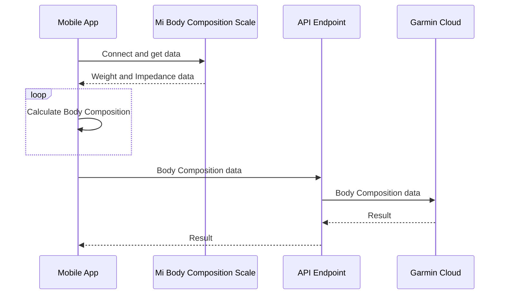

#  mi-scale-exporter
Mobile App to export data from Mi Body Composition Scale and upload it to Garmin Connect Cloud. It also allows you to upload manually entered body composition data to the Garmin cloud..

Tested on Oneplus 5T (Android 10) and Mi Body Composition Scale (XMTZC02HM)

## Instruction

- Stand on your scale. Measure yourself. Complete the user form data, Scale Bluetooth address and get data from the scale. Mi Body Composition Scale is active up to 15 min after the measurement. (Bluetooth address can be found in Mi Fit > Profile > My devices > Mi Body Composition Scale > Bluetooth address (hold to copy)).

- Then you can review your data and upload it to Garmin Cloud. If you do not have Mi scale and just want to manually insert the data, you can so.

- You can save the Garmin password in this App but you don't have to. Passwords Managers like KeePass2 works well too.

- This App pass your data, email and password to API server and then it sends to Garmin Cloud.

- The API does not store or log anything, it's just a middleware between this App and Garmin services.

- API repository: https://github.com/lswiderski/bodycomposition-webapi

- If you want, you can host your own API server. Just change the server address in Settings.

 ## Diagram



## API Endpoint used in the app ([source](https://github.com/lswiderski/bodycomposition-webapi))

```http
https://garmin.bieda.it/
```

## Stack
- Xamarin forms (C#)
- Autofac
- Plugin.BLE - To receive data via Bluetooth from Mi scale
- Xamarin.Essentials
- API Backend in GOlang

## Inspiration

- https://github.com/RobertWojtowicz/miscale2garmin
- https://github.com/davidkroell/bodycomposition

## Coffee

<a href="https://www.buymeacoffee.com/lukaszswiderski" target="_blank"></a>
